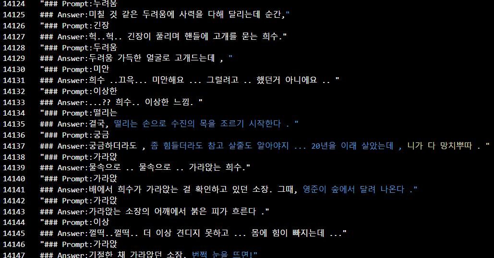

# LLM 프로젝트 결과보고서

## 프로젝트 개요

- **프로젝트 명:** 사건 시뮬레이션 시스템 > 감정기반 대본작성 시스템
- **프로젝트 기간:** 2023.08.29 ~ 2023.12.12
- **프로젝트 목적:** 창작 분야에서 AI의 활용을 통해 창작 과정 혁신 및 작업 효율성 증대
- **프로젝트 참여자:** 이규범 202221014

## 데이터 수집

- **데이터 수집 소스:** 게임 스토리, 소설, 라이트 노벨, 영화 대본 등의 다양한 창작 콘텐츠
- **데이터 양과 형식:** 텍스트 데이터로 수집하며, 각 창작 콘텐츠의 내용을 활용

## 모델 설계

- **사용한 LLM 모델:** LDCC/LDCC-Instruct-Llama-2-ko-13B-v1.4
- **모델 튜닝:** LDCC/LDCC-Instruct-Llama-2-ko-13B-v1.4 모델을 NEFTune noise embeddings 및 Direct Preference Optimization (DPO)을 활용하여 fine-tuning하였다.
- **하이퍼파라미터:** 
  - Learning Rate: 2E-4
  - Batch Size: 1
  - Epochs: 4
  - Block Size: 1024
  - Warmup Ratio: 0.1
  - Weight Decay: 0.01
  - Gradient Accumulation: 4
  - 사용된 기타 하이퍼파라미터 및 설정을 여기에 추가하세요.
- **모델 아키텍처:** beomi/llama-2-koen-13b

## 실험 및 결과

- **실험 환경:** 실험은 다음과 같은 컴퓨터 환경에서 수행되었습니다.
  - GPU: NVIDIA A100-SXM4-40GB
  - 드라이버 버전: 450.80.02
  - CUDA 버전: 11.8

- **실험 과정:** 실험은 다음과 같은 과정으로 진행되었습니다.
  1. 데이터 전처리: 수집한 텍스트 데이터(대본, 스토리, 소설)를 정제하고 모델 학습에 적합한 형식으로 가공했다.
     - 수집한 데이터를 hwp파일로 모두 다운로드 받은 후 하나의 파일에 pdf형태로 저장한다.
     - #씬, #scene, #32 등 학습에 불필요한 장면전환 단어들을 모두 제거한다.
     - 감정을 읽기 위하여 감정과 관련된 단어를 약 5천가지 선정하여 분리한다.
     - 정리된 데이터를 학습모델에 사용할 수 있도록 prompt Template에 맞춰 정리한다.

---

### Prompt Template 예시
  #### Prompt:
  {instruction}

  #### Answer:
  {output}

---

  2. 모델 학습: LDCC/LDCC-Instruct-Llama-2-ko-13B-v1.4 모델을 직접 만든 데이터셋을 사용하여 fine-tuning하였다.

  3. 성능 평가: 글을 잘 작성했다는 평가를 수치적으로 표현하기엔 어려움이 있어서, 직접 완성된 글을 읽고 자연스러운 글이 작성됐는지, 주제에 대한 글을 작성했는지 판단하였다.
  
  4. 실험 내용
     처음 코드를 작동하였을때 LDCC의 모델이 너무 많은 RAM을 사용하여 GPU의 RAM이 부족하여 코드가 동작하지 않았다. 따라서 코드를 수정하여 모델을 4비트 정밀도로 로드하여 메모리 사용량을 대폭 줄였다.

---
#### 기존 코드
model = AutoModelForCausalLM.from_pretrained(model_path)

#### 변경 코드
model = AutoModelForCausalLM.from_pretrained(model_path, load_in_4bit=True, device_map="auto")

---
     

- **결과:** 실험 결과, LDCC/LDCC-Instruct-Llama-2-ko-13B-v1.4 모델은 시나리오 생성 및 심리학적 요소 반영에서 높은 성능을 보였습니다. 이 모델을 통해 창작자들은 보다 다양하고 현실적인 스토리를 빠르게 개발할 수 있게 되었습니다.

## 결과 해석

- **결과 해석:** 프로젝트의 결과로 창작자들은 보다 다양하고 현실적인 스토리를 빠르게 개발할 수 있게 될 것이다. 하지만 제한된 리소스와 데이터의 접근성 문제는 극복해야 할 도전이다.
- **향후 계획:** 더 많은 데이터 수집, 모델의 개선, 리소스 확보 등을 통해 프로젝트의 성과를 높이는 것이 중요하다.

## 결론

- **결론:** "사건 시뮬레이션 시스템" 프로젝트는 창작 분야에서의 AI 활용을 통해 창작 과정을 혁신하고 작업 효율성을 높이는 데 중요한 발판이 될 것이다.

## 참고 문헌

대본 - 필름메이커스 커뮤니티 (https://www.filmmakers.co.kr/koreanScreenplays)

게임스토리 및 소설 - 나무위키(스토리) (https://namu.wiki/w/%EC%8A%A4%ED%86%A0%EB%A6%AC)

LLM 모델 - LDCC/LDCC-Instruct-Llama-2-ko-13B-v1.4 (https://huggingface.co/LDCC/LDCC-Instruct-Llama-2-ko-13B-v1.4)
